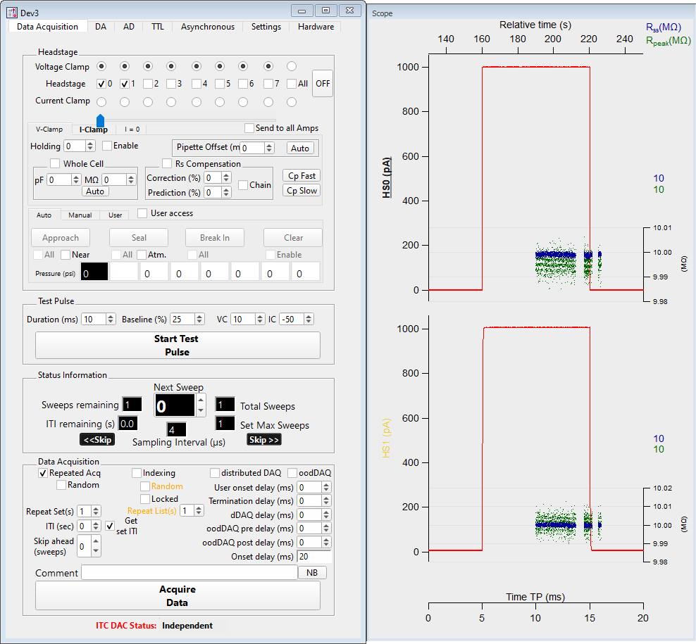

.. _daephys:

Da_Ephys
========

GUI control of data acquisition is achieved using the DA_Ephys panel. For
example, the user can assign a stimulus set to a digital to analog (DA)
channel. The DA_Epys panel centralizes control of multiple hardware components
necessary for performing electrophysiology experiments, including the DAC,
amplifier, and pressure regulators.

.. _Figure DA Ephys panel:

   Main data acquisition panel

TODO fill me

.. _daephys_oodDAQ:

Optimized overlap distributed DAQ (oodDAQ)
~~~~~~~~~~~~~~~~~~~~~~~~~~~~~~~~~~~~~~~~~~

TODO fill me

.. _daephys_dDAQ:

Distributed DAQ (dDAQ)
~~~~~~~~~~~~~~~~~~~~~~~~

TODO fill me
