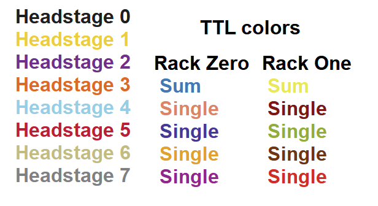

.. _databrowser:

DataBrowser
-----------

.. toctree::
  :maxdepth: 1

  databrowser_paplot
  databrowser_overlaysweeps
  databrowser_channelselection
  databrowser_settings

The DataBrowser allows the user to view acquired sweeps and metadata
during and after an experiment. It has several display modes that facilitate
recording from multiple channels simultaneously.

.. todo: fillme

.. _Figure Relevant Colors:

Relevant Colors
"""""""""""""""

   Color scheme used throughout the DataBrowser and other panels which display information
