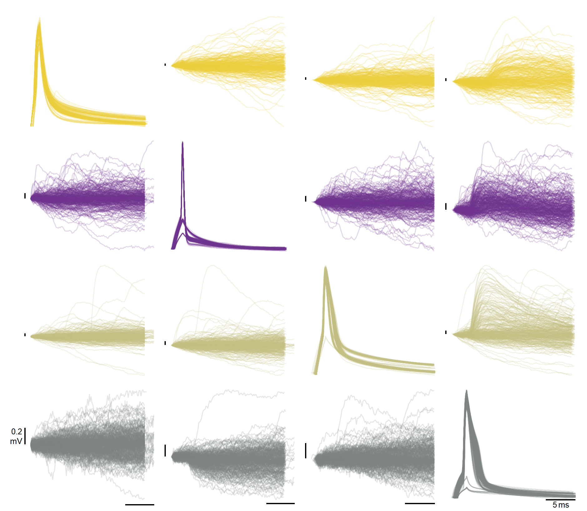
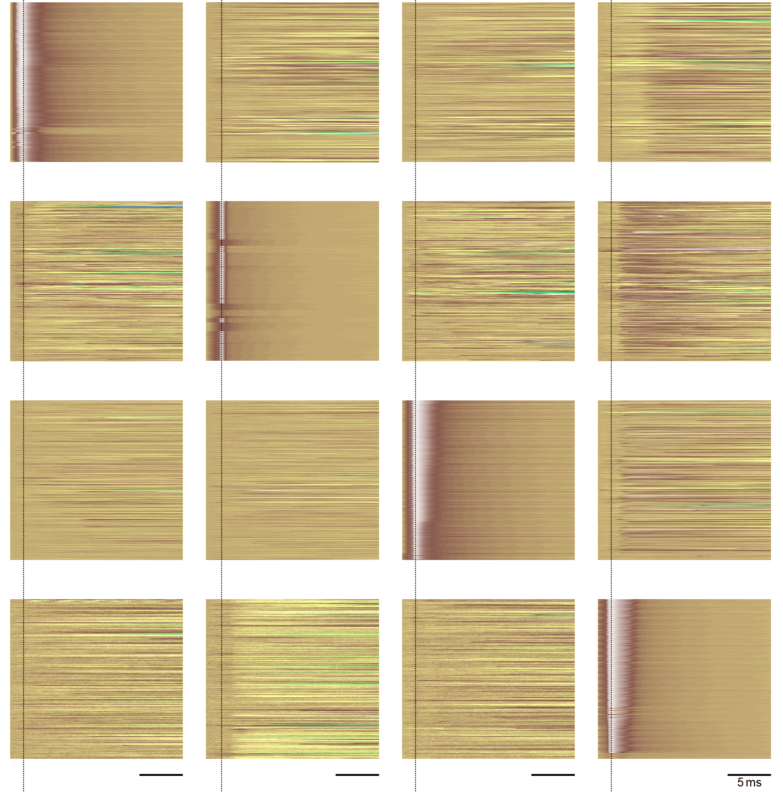
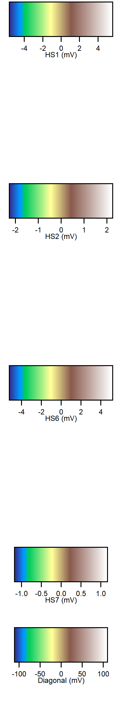
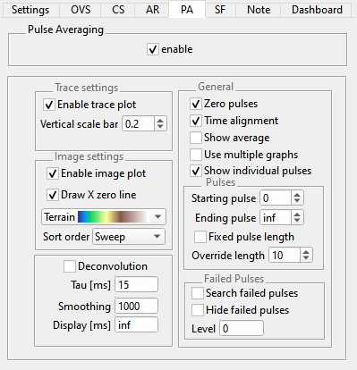

.. _db_paplot:

Pulse Average (PA) plot
=======================

When the stimulus set contains multiple pulses the pulse average plot allows to
extract these single pulses to overlay, and average and visually inspect these.

Although the stimulus set will contain :ref:`wavebuilder_pulsetrain` epochs in
most cases, the pulse extraction algorithm works with all epoch types and
special measurement modes like :ref:`daephys_dDAQ` or :ref:`daephys_oodDAQ`.

The dDAQ slider from the :ref:`db_settings` tab is respected as is the :ref:`db_channelselection`.

For instructional purposes assume you have acquired a pulse train with oodDAQ on 4 different headstages.
This means you have 4 active headstages with each a DA and AD channel. We
only visualize the AD data in the PA plot.

The PA plot will then have 16 = 4 x 4 PA sets (either in one big graph or in multiple graphs).

Each set will have one source of pulse starting times (called "region")
and one source of the visualized data. The pulse starting times are always
extracted from the DA channel of the region.

That means the top left set is from the first region and the first
active headstage, the one to the right is from the second region and the
first active headstage. Or to put it differently, regions are the columns.

The following two figures, :ref:`Figure Pulse Average Trace plot` and
:ref:`Figure Pulse Average Image plot`, were created with multiple sweeps
overlayed, see :ref:`db_overlaysweeps`, and time alignment and zeroing turned on.

.. _Figure Pulse Average Trace plot:

Trace plot
""""""""""

   Trace plot

The trace plot is a display of all single pulses from a PA set as traces. The
scale bars, shown in black, give an impression of the data range. The trace
colors coincide with the trace colors used in the databrowser and denote the
headstage of the data, see also :ref:`Figure Relevant Colors`.

.. _Figure Pulse Average Image plot:

Image plot
""""""""""

.. raw:: html

   
&nbsp;&nbsp;&nbsp; 

This graph is an alternative display to the :ref:`Figure Pulse Average Trace
plot`. Its advantage is a much faster updates for displaying many overlayed
sweeps. Each set image has the average and the deconvolution data at the
bottom. When these are not shown a blank space is left empty.
On top of these the single pulse data is shown. Each data is displayed as rows
(horizontally), and the image is filled from bottom to top depending on the
:ref:`db_paplot_image_sortorder`.

.. _db_paplot_image_sortorder:

Sort Order
^^^^^^^^^^

The following tables visualizes the display of one image set with two sweeps
overlayed and three pulses using different ``Sort Order`` settings. The
ordering is always ascending and from bottom to top. Due to implementation
details the ``Sweep`` sort order allows **much** faster incremental updates
(only relevant during data acqisition).

.. table:: Comparing different sort orders

   +----------------+----------------+
   | Sweep          | Pulse          |
   +================+================+
   |Pulse 2, Sweep 1|Pulse 2, Sweep 1|
   +----------------+----------------+
   |Pulse 1, Sweep 1|Pulse 2, Sweep 0|
   +----------------+----------------+
   |Pulse 0, Sweep 1|Pulse 1, Sweep 1|
   +----------------+----------------+
   |Pulse 2, Sweep 0|Pulse 1, Sweep 0|
   +----------------+----------------+
   |Pulse 1, Sweep 0|Pulse 0, Sweep 1|
   +----------------+----------------+
   |Pulse 0, Sweep 0|Pulse 0, Sweep 0|
   +----------------+----------------+
   |Deconvolution   |Deconvolution   |
   +----------------+----------------+
   |Average         |Average         |
   +----------------+----------------+

.. _db_paplot_timealignment:

Time Alignment
^^^^^^^^^^^^^^

The pulses from different channels might not have the same time basis. Time alignment is a way to correct for these offsets.

The algorithm is as follows:

- Get the feature position ``featurePos`` for all pulses which belong to the
  same set. Store these feature positions using their sweep number and pulse
  index as key.
- Now shift all pulses in all sets from the same region by ``-featurePos``
  where ``featurePos`` is used from the same sweep and pulse index.

.. _db_paplot_operation_order:

Operation order
^^^^^^^^^^^^^^^

The operations on the data happens in the following fixed order:

- Gather pulses
- Apply pulse sort order
- Failed pulse searching
- Zeroing
- Time alignment
- Averaging

PA plot settings
^^^^^^^^^^^^^^^^

The following figure shows the browser settings panel for the PA plot. It can
be reached from the ``PA`` tab in the Databrowser. The next sections explain each control.

.. _Figure Pulse Average Browser Settings:

   Settings for the pulse average plot

Pulse Averaging
"""""""""""""""

- ``enable``: Toggle the display of the PA image/trace plots.
  Can be turned off before tweaking the settings and then reenabled to make
  changing the settings quicker.

Image settings
""""""""""""""

- ``Enable image plot``: Toggle the display of the :ref:`Figure Pulse Average Image plot`
- ``Draw X zero line``: Draw a vertical line at ``X == 0`` when
  time alignment is turned on. Helps with distinguishing true from false responses.
- ``Popup Menu``: Color scheme for image plots
- ``Sort order``: Sort order of the shown pulses. For ``Sweep`` the pulses are
  first ordered by sweep number and then by pulse index. For ``Pulse`` it is
  first pulse index and then sweep number. See also
  :ref:`db_paplot_image_sortorder`.

Trace settings
""""""""""""""

- ``Enable trace plot``: Toggle the display of the :ref:`Figure Pulse Average Trace plot`.
- ``Vertical scale bar``: Size of the vertical scale bar in y-axis units

Deconvolution
"""""""""""""

- ``Deconvolution``: Toggle the deconvolution pulse display, this is caculated
  from the averaged pulses [#1]_. For the image plot, the average is the second
  bottom-most row.
- ``Tau [ms]``: Time constant [#2]_
- ``Smoothing``: Smoothing parameter, use ``1`` to disable smoothing
- ``Display [ms]``: Time range of the average pulse used for the deconvolution, use ``inf`` to use the full range

General
"""""""

- ``Zero pulse``: Toggle Pulse Zeroing. This is done by Differentiation and Integration.
- ``Time alignment``: Toggle time alignment of pulses from one column. See :ref:`db_paplot_timealignment` for an in-depth explanation.
- ``Show average``: Toggle average pulse display. For the image plot, the average is the bottom-most row.
- ``Use multiple graphs``: Toggle the display mode. When unchecked a single
  graph is used for all traces and images, when checked a separate graph is
  used for each PA set.
- ``Show individual pulses``: Toggles the display of the single pulses. Turning
  that off can increase the display update performance. The average and
  deconvolution are still shown if enabled.

Pulses
""""""

- ``Starting pulse``: First pulse index to display, 0-based.
- ``Ending pulse``: Last pulse index to display, use ``inf`` to use the last pulse.
- ``Fixed pulse length``: Choose the calculation method of the pulse lengths.
  When unchecked the pulse length is calculated as the average pulse length
  from the extracted pulses. When checked the ``Override length`` is used.
- ``Override length``: Pulse length to use when no length can be calculated
  [#3]_ or when ``Fixed pulse length`` is checked

Failed Pulses
"""""""""""""

Pulses which don't cross the given level can be highlighted or hidden depending on the settings.

- ``Search failed pulses``: Toggle the failed pulse search
- ``Hide failed pulses``: When a pulse failed, hide instead of highlight.
- ``Level``: Level in y-data units to search for failed pulses. Every pulse not
  reaching that level is considered failing. As mentioned in
  :ref:`db_paplot_operation_order` that search is done before zeroing.

.. [#1] See `doi:10.1152/jn.00942.2007 <https://www.physiology.org/doi/full/10.1152/jn.00942.2007>`__ for the implemented method
.. [#2] The following equation holds:
.. math:: \tau \cdot \frac{dV}{dt} + V = f
.. [#3] The reason that the pulse length can not be calculated can either be due to the fact that only one pulse could be found, or with pulse distribution methods like ``Poisson distribution`` from the ``Pulse Train`` stimulus epoch type.
