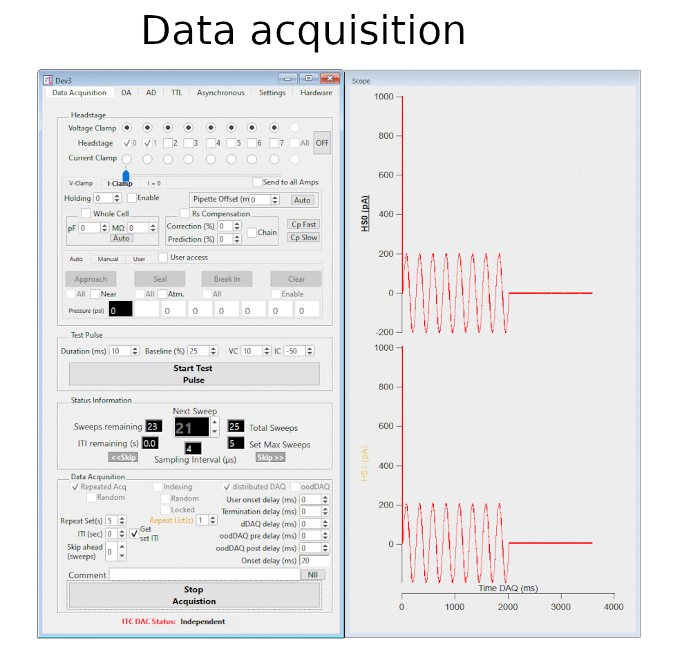

MIES is a sweep based data acquisition software package for intracellular
electrophysiology (patch clamp). It offers top of its class flexibility and
robustness for stimulus generation, data acquisition/evaluation and has
proven to be a valuable tool in the literature \[[1](https://doi.org/10.1038/s41593-019-0417-0),
[2](https://elifesciences.org/articles/37349)\].

## Highlights
- Acquire data on up to eight headstage using up to five DACs simultaneously
- Create arbitrarily complex stimulus sets with an easy to use GUI
- Export **all** data including **all** of its metadata into the industry-standard
  [NWBv2-format](https://alleninstitute.github.io/MIES/IPNWB/index.html) and
  read it back in
- Run custom code during data acquisition for [Automatic Experiment
  Control](https://alleninstitute.github.io/MIES/file/_m_i_e_s___analysis_functions_8ipf.html#file-mies-analysisfunctions-ipf)
- Completely automate the experimental setup using [JSON configuration files](https://alleninstitute.github.io/MIES/file/_m_i_e_s___configuration_8ipf.html#file-mies-configuration-ipf)
- Interact with MIES from other programming languages (Python, C++, Javascript, ...) using [ZeroMQ](https://alleninstitute.github.io/MIES/ZeroMQ-XOP-Readme.html).
- Use the integrated [scripting
  language](https://alleninstitute.github.io/MIES/SweepFormula.html#the-sweep-formula-module)
  for convenient on-the-fly data evaluation
- Fully backwards compatible with **every** earlier MIES version

## Supported Hardware

- Instrutech/HEKA ITC [18](http://www.heka.com/downloads/hardware/manual/m_itc18.pdf) and [1600](http://www.heka.com/downloads/hardware/manual/m_itc1600.pdf) devices
- National Instruments:
  [PCIe-6343](https://www.ni.com/en-us/support/model.pcie-6343.html)
  and [PXI-6259](https://www.ni.com/en-us/support/model.pxi-6259.html)
- Amplifier (optional): Molecular Devices 700B
- Pressure control (optional): ITC 18/1600 or National Instruments [USB 6001](https://www.ni.com/en-us/support/model.usb-6001.html)

## Required Software

- Windows 10 x64
- [Igor Pro 8.04 (nightly) or later](https://www.wavemetrics.com/)
- [NIDAQ MX XOP](https://www.wavemetrics.com/products/nidaqtools/nidaqtools.htm)

## Getting started

- Download the latest release from [here](https://github.com/AllenInstitute/MIES/releases/tag/latest)
- Run the installer
- View the documentation
  [here](https://alleninstitute.github.io/MIES/user.html)

## Support statement

The last released version receives fixes for all critical bugs.

## Bug reporting

Please have a look [here](https://alleninstitute.github.io/MIES/reportingbugs.html).
